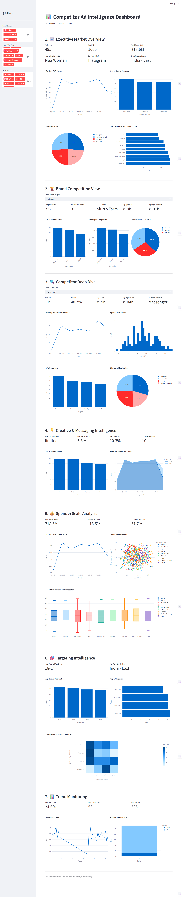

# 📊 Competitor Ad Intelligence Dashboard  
### Meta Ads Library Inspired Analytics Platform


---

## 📌 Project Overview

The **Competitor Ad Intelligence Dashboard** is an interactive analytics platform built using **Streamlit**.  

It is designed to analyze and visualize advertising trends inspired by the **Meta Ads Library**, helping users explore competitor ad strategies, creative formats, engagement patterns, and campaign trends through a structured and user-friendly dashboard.

This project demonstrates how advertising data can be transformed into meaningful strategic insights using data visualization and filtering tools.

---

## 🎯 Objective

The primary goal of this project is to:

- Track competitor advertising activity  
- Analyze ad formats (Image, Video, Carousel)  
- Identify engagement and trend patterns  
- Compare advertiser strategies  
- Support data-driven marketing decisions  

---

## 🛠 Tech Stack

- **Frontend & Application Framework:** Streamlit  
- **Data Processing:** Python (Pandas)  
- **Visualization:** Plotly (Graph Objects & Express)  
- **Dataset:** Structured dataset modeled on Meta Ads Library exports  
- **Deployment Ready:** Streamlit Cloud  

---

## 📊 Key Features

### 1️⃣ Overview Metrics
- Total Ads Tracked  
- Active vs Inactive Ads  
- Ad Format Distribution  
- Engagement Overview  

### 2️⃣ Advanced Filtering
- Filter by Advertiser Name  
- Filter by Ad Type  
- Filter by Date Range  
- Keyword-based Search  

### 3️⃣ Performance Insights
- Engagement Comparison Charts  
- Ad Format Trends  
- Advertiser Activity Timeline  
- Campaign Objective Breakdown  

### 4️⃣ Competitor Comparison
- Side-by-side advertiser analysis  
- Format usage comparison  
- Strategic trend insights  

---

## 📸 Dashboard Preview

<p align="center">
  
</p>

> Interactive Streamlit dashboard visualizing competitor advertising data.

---

## 📂 Project Structure

```
competitor-ad-dashboard/
│
├── main.py                          # Main Streamlit application
├── meta_ad_library_dataset.csv      # Structured ad dataset (modeled sample data)
├── README.md                        # Project documentation
└── assets/
    └── screenshot-dashboard.png     # Dashboard screenshot
```

---

## 📈 Dataset Description

The dataset includes structured advertising information such as:

- Advertiser Name  
- Ad ID  
- Ad Format (Image / Video / Carousel)  
- Start Date & End Date  
- Engagement Metrics  
- Estimated Reach Category  
- Platform Placement  
- Campaign Objective  

The data structure reflects real-world ad library exports and is formatted for analytical demonstration purposes.

---

## 🌐 Deployment

This project can be deployed using:

- Streamlit Community Cloud  
- Render  
- Hugging Face Spaces  


## 🚀 Future Enhancements

- Live integration with Meta Ads Library API  
- Automated competitor monitoring alerts  
- AI-driven creative messaging analysis  
- Downloadable PDF or CSV insight reports  

---

## 👩‍💻 Author

**Pratiksha Priyadarshini**  
Analytics & Management Enthusiast  

Developed as a prototype competitor intelligence dashboard project.

---

## 📜 License

This project is developed for academic and demonstration purposes only.

## 📂 Project Structure
